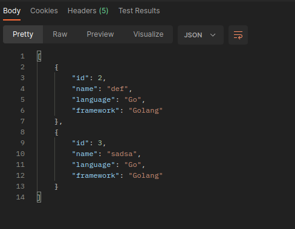
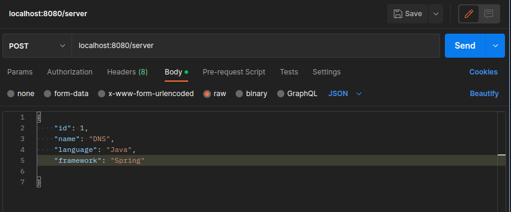
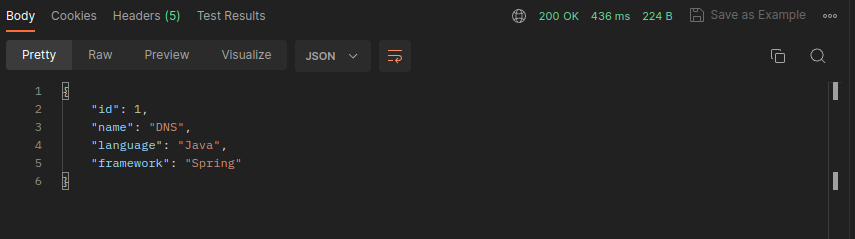
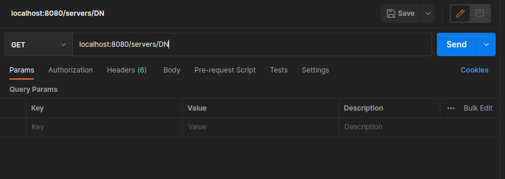
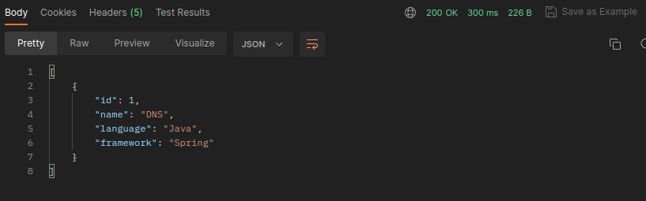
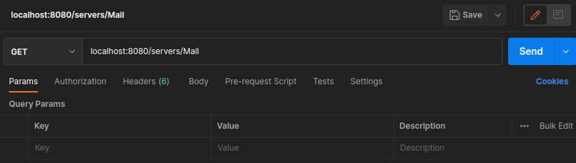
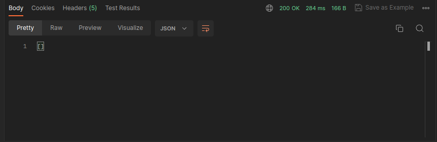
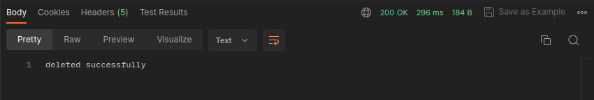
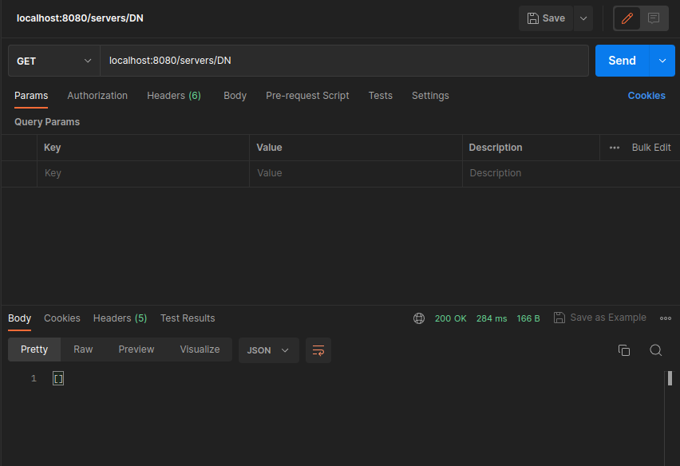

# Server REST API

## Get list of Servers

Returns list of all servers in database.

### Request

### Response

## Create a new Server

Create new Server in database.

### Request

### Response

## Search Server by name

Returns all the servers cointaing provided string in the name field of the server(Case Sensitive).

### Request

### Response

## Get a non-existent Server

### Request

### Response

## Delete Server by ID

### Request

### Response

### Result

